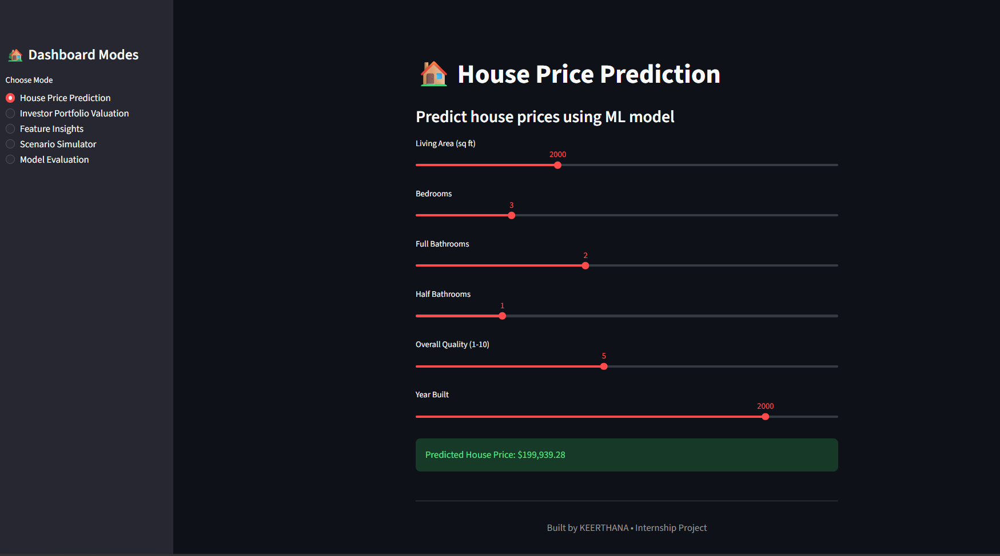
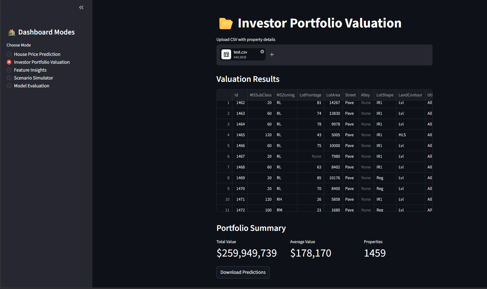
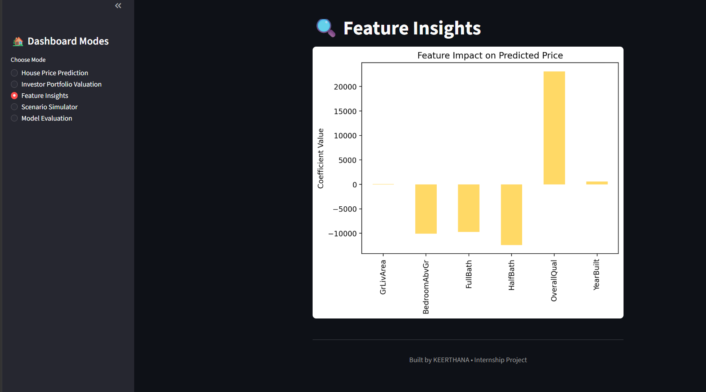
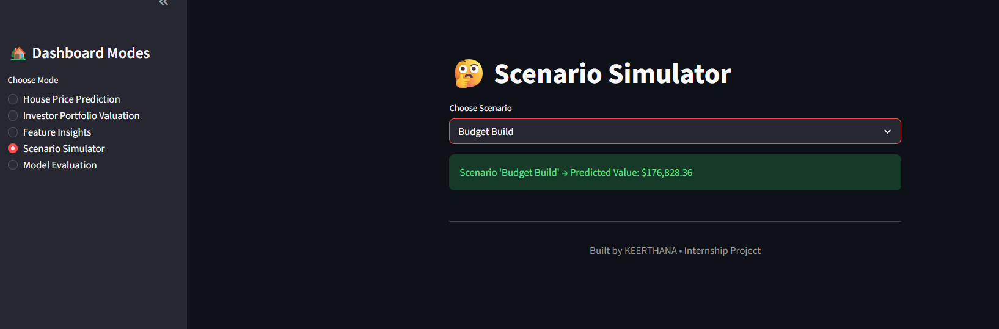
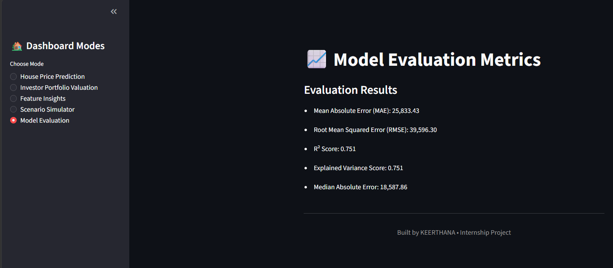

# 🏠 House Price Prediction Dashboard

An interactive machine learning dashboard that predicts house prices based on property features.  
Built with **Python, scikit-learn, Streamlit, Seaborn, and Matplotlib**.

---

## 📌 Overview
This project demonstrates how machine learning can be applied to real estate valuation.  
It includes:
- A regression model trained on housing data.
- Interactive dashboard modes for prediction, portfolio valuation, feature insights, scenario simulation, and model evaluation.
- Clean pastel visuals for professional presentation.

---

## ⚙️ Features
- **House Price Prediction**: Estimate sale price based on property features.
- **Investor Portfolio Valuation**: Upload a CSV of multiple properties and get predicted values with summary KPIs.
- **Feature Insights**: Visualize feature importance using regression coefficients.
- **Scenario Simulator**: Explore “Luxury Upgrade,” “Budget Build,” and “Modern Renovation” what‑if cases.
- **Model Evaluation**: Includes alternative metrics (Median AE, Explained Variance, MAPE) for deeper analysis.
- **CSV Export**: Download predictions for further analysis.

---

## 📊 Model
- **Algorithm**: Linear Regression
- **Features Used**:
  - GrLivArea (Living Area)
  - BedroomAbvGr (Bedrooms)
  - FullBath (Full Bathrooms)
  - HalfBath (Half Bathrooms)
  - OverallQual (Overall Quality)
  - YearBuilt (Construction Year)

- **Evaluation Metrics** (fill in after running):
  - Mean Absolute Error (MAE): `XX`
  - Root Mean Squared Error (RMSE): `XX`
  - Median Absolute Error: `XX`
  - Explained Variance Score: `XX`
  - R² Score: `XX`

---

## 🖼️ Dashboard Screenshots

### House Price Prediction


### Investor Portfolio Valuation


### Feature Insights


### Scenario Simulator


### Model Evaluation



---

## 🚀 How to Run
1. Clone the repository:
   ```bash
   git clone https://github.com/keerthanarajr/SCT_ML_1.git
   cd SCT_ML_1