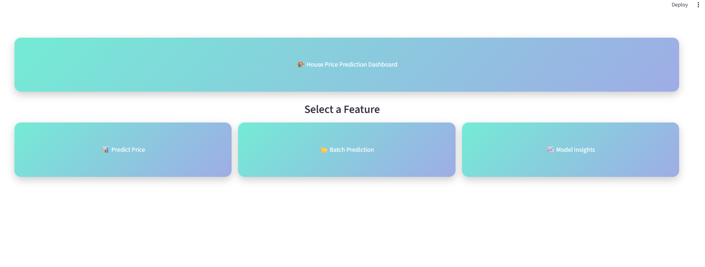
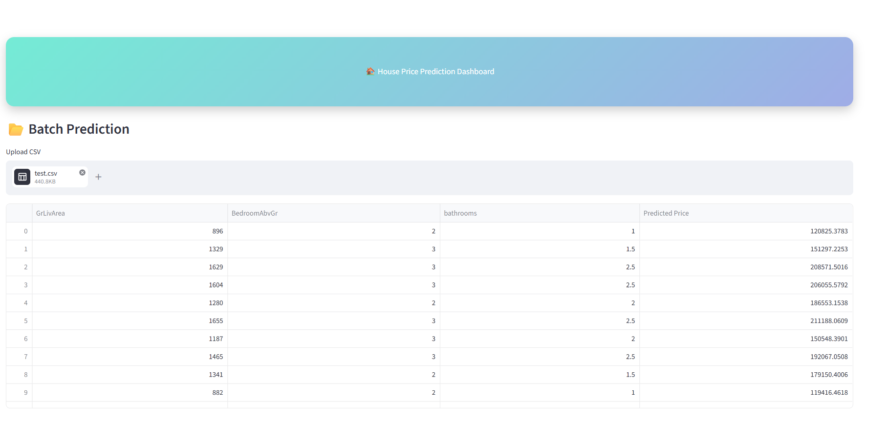
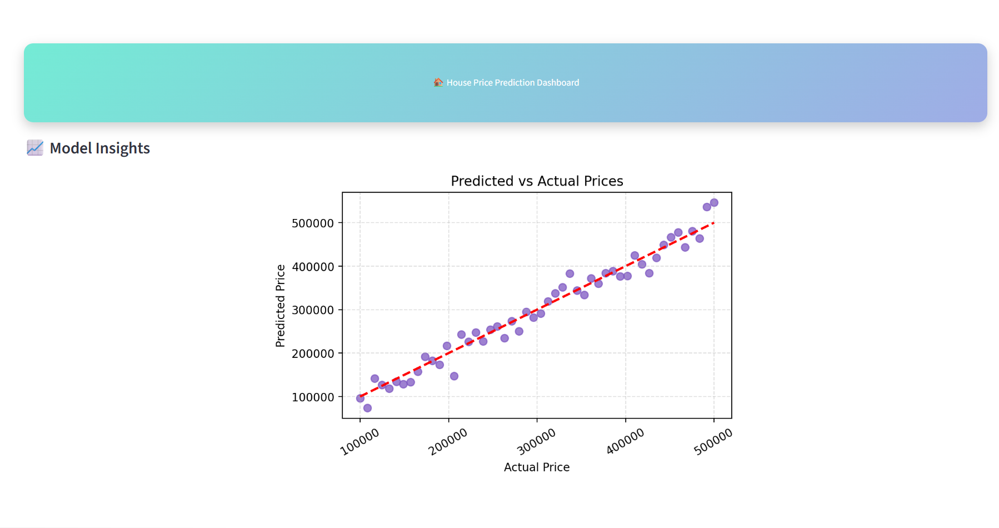

# 🏠 House Price Prediction Dashboard

An interactive machine learning dashboard that predicts house prices based on property features.  
Built with **Python, scikit-learn, Streamlit, Seaborn, and Matplotlib**.

---

## 📌 Overview
This project demonstrates how machine learning can be applied to real estate valuation.  
It includes:
- A regression model trained on housing data.
- Interactive dashboard modes for single property prediction, batch valuation, and model insights.
- Clean pastel visuals for professional presentation.

---

## ⚙️ Features
- **📊 Single Property Prediction**: Enter property details (square footage, bedrooms, bathrooms) and get an estimated sale price.
- **📂 Batch Prediction**: Upload a CSV file of multiple properties and generate predicted values for each.
- **📈 Model Insights**: Visualize predicted vs. actual prices with scatter plots and regression lines.
- **Gradient Banner Navigation**: A single pastel gradient banner acts as the main title and navigation back to Home.
- **Clean UI**: Big clickable feature cards with hover effects, consistent pastel palette, and clutter-free layout.

---

## 📊 Model
- **Algorithm**: Linear Regression
- **Features Used**:
  - GrLivArea (Living Area)
  - BedroomAbvGr (Bedrooms)
  - FullBath (Full Bathrooms)
  - HalfBath (Half Bathrooms)

- **Workflow**:
  - Train the model using `model.py`.
  - Save the trained model into `production_artifacts/house_price_model.joblib`.
  - Load the model in `app.py` for predictions.

---

## 🖼️ Dashboard Screenshots


### Home Page


### Single Property Prediction


### Batch Prediction


### Model Insights



---

## 🚀 How to Run
1. Clone the repository:
   ```bash
   git clone https://github.com/keerthanarajr/SCT_ML_1.git
   cd SCT_ML_1
   ```
2. Install dependencies:
   ```bash
   pip install -r requirements.txt
   ```
3. Train the model (if not already saved):
   ```bash
   python model.py
   ```
4. Launch the dashboard:
   ```bash
   streamlit run app.py
   ```
5. Open the app in your browser at `http://localhost:8501`.
